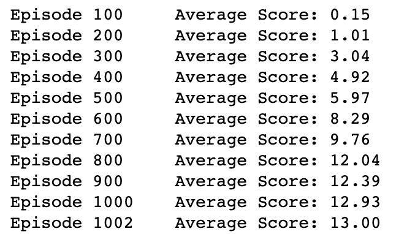
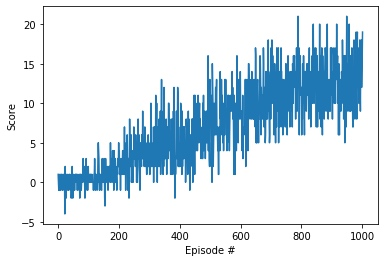

# Learning Algorithm
1. Hyperparameters
all hyperparameters input into the major train function "dqn" in Navigation.ipynb include: 
    * n_episodes = 2000: maximum number of training episodes
    * window_size = 100: the window size of episodes to calculate average score
    * eps_start = 1.0 : starting value of epsilon, for epsilon-greedy action selection
    * eps_end = 0.05: minimum value of epsilon
    * eps_decay = 0.998: multiplicative factor (per episode) for decreasing epsilon
    * relay_buffer_size = 100000: the buffer size of experience relay
    * batch_size = 64: the batch size of random selected experiences from the relay buffer
    * gamma = 0.99: discount factor to accumulate the rewards
    * tau = 0.001: soft update of target parameters
    * lr = 0.0005: learning rate
    * update_every = 4: how often to update the network
    * hidden_layers_size = [64, 32]: the sizes of hidden layers in neural network
    
1. neural network
    the neural network used to regress the action value function is a 3 levels of fully connected network, followed by relu activation function after each hidden layer:
    * fc1 - input_size = 37, output_size = 64
    * fc2 - input_size = 64, output_size = 32
    * output - input_size = 32, output_size = 4
2. adopted algorithms for Q Learning
    * Experience Relay
    * Double DQN

1. Implemented Algorithm
    * initial the Q learning agent with:
        * the relay memory cache D with capacity buffer_size
        * the neural network of local action value function qnetwork_local with random weight θ
        * the neural network of target action value function qnetwork_target with random weight θ-
    * for episode from 1 to n_episodes:
        * initial environment state S
        * while True:
            * choose action A by qnetwork_local from state S according to epsilon-greedy policy
            * environment takes action A, return reward R and next state S’ and Done flag
            * store experience tuple (S, A, R, S’) into relay memory cache D
            * if the relay memory cache size > batch_size & action steps over interval update_every:
                * generate random minibatch of experience tuples (st, at, rt, st+1) from relay cache D with size buffer_size
                * calculate yt according to Double DQN algorithm
                * perform gradient descent step on (yt-Q(st, at; θ))2 to update qnetwork_local’s weight θ
                * soft update qnetwork_target’s weight θ- with parameter tau and qnetwork_local’s weight θ 
           * if Done then break
       * update epsilon coefficient
    
    
# Plot of Rewards
The average reward over 100 episodes exceeds +13 in around 1000 episodes:

# Ideas for Future Work
Some other improvements of Deep Q Learning may considered:
* Currently the update of local Q network and target Q network is at the same time, Fixed Q targets can be used to reduce the harmful correlation caused by updating a guess by guess
* Consider to use the prioritized experience relay to find more important experiences from the relay
    